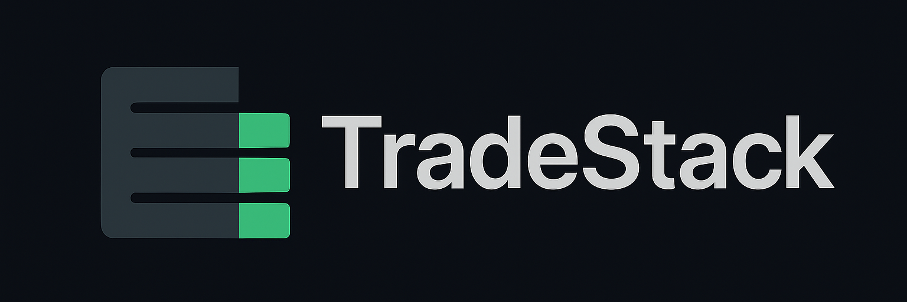

<p align="center">
  
</p>

A simple and fast implementation of an order book in C++ for
back testing, simulations and real-time trading applications.

### Build & Run

```bash
git clone https://github.com/majorbruteforce/tradestack.git
cd tradestack
chmod +x ./scripts/run.sh
./scripts/run.sh
```

### Run Tests

```bash
chmod +x ./scripts/run_tests.sh
./scripts/run_tests.sh [<testname>]
```

## Features

### Order Book Engine

- [ ] Submitting limit and market orders
  - [x] AVL helpers for BST balancing
  - [x] Self-balancing BST for sides
  - [ ] Insertion in BST
  - [ ] Deletion in BST
  - [ ] Inorder access in BST
  - [ ] Order Modification
- [ ] Matching limit orders, market orders
  - [ ] Price-time priority matching
  - [ ] Order Status Events
    - [ ] Accepted/Rejected
    - [ ] Partially Filled
    - [ ] Completely Filled
    - [ ] Cancelled
  - [ ] Send trade events down message bus
    - [ ] Setup up RabbitMQ/Kafka
    - [ ] Event stream ingress
    - [ ] Event stream egress
- [ ] Market Data Feed
  - [ ] **Top-of-book** for best bid, best ask and LTP
  - [ ] **Depth-of-book** for aggregated order volume at each price level
  - [ ] **Full Depth** for every individual order and it's position in the book
- [ ] Time series order regeneration and retrieval

### FIX Engine

- [ ] Basic FIX message parsing
- [ ] Support for New Order Single (35=D)
- [ ] Support for Order Cancel Request (35=F)
- [ ] Support for Execution Reports (35=8)
- [ ] FIX 4.2 message validation
- [ ] Stateless message processing core

### Testing

- [ ] Unit tests for order book
  - [x] AVL helpers (rotation and height)
- [ ] Segregate tests
- [ ] Unit tests for FIX parser
- [ ] Benchmarking and profiling utilities
- [x] Build system with CMake
